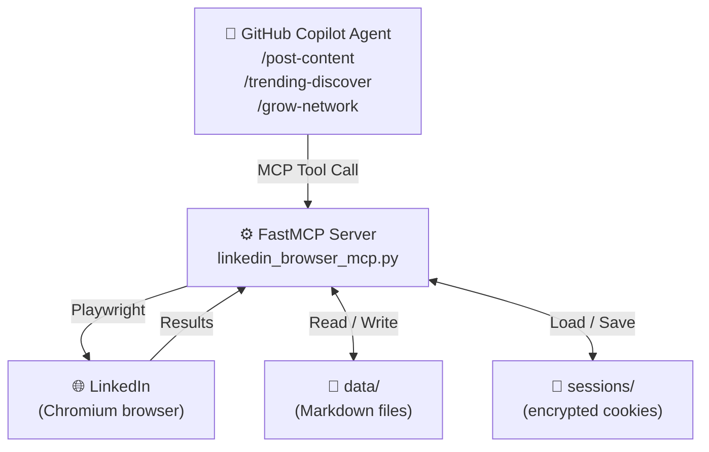
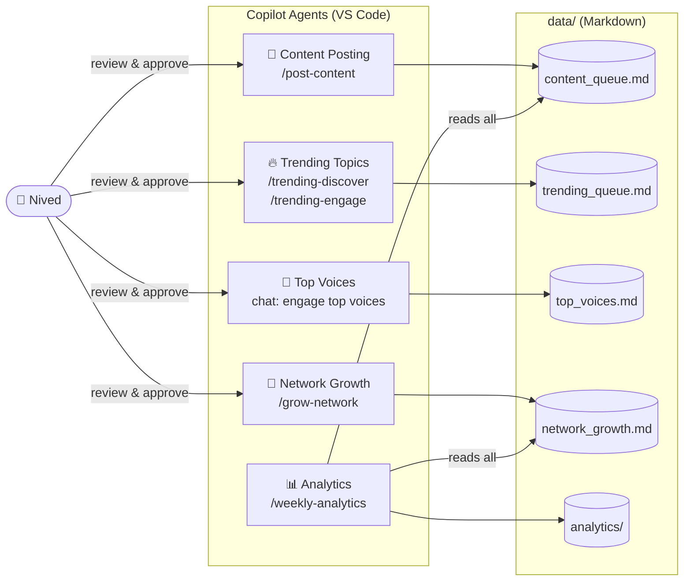
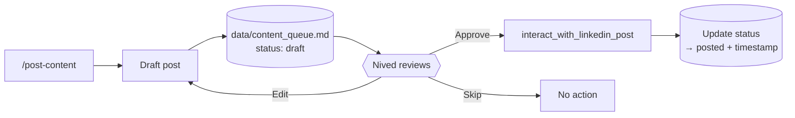
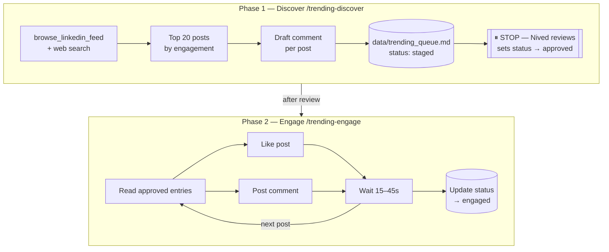
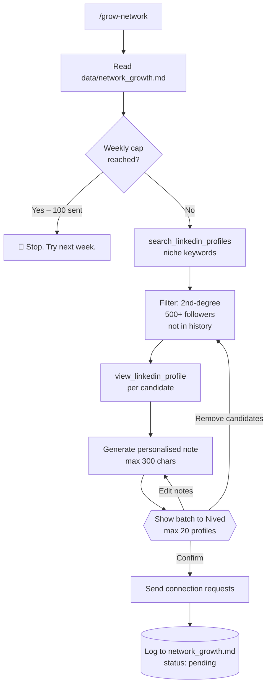
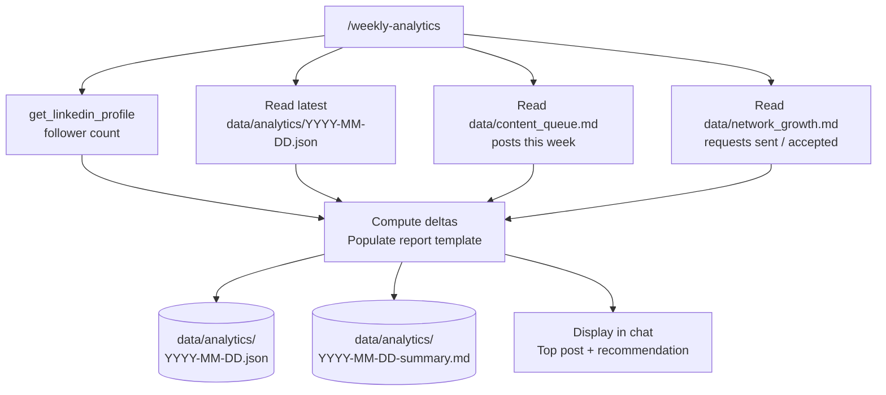

# LinkedIn MCP Server

A LinkedIn automation system built on [FastMCP](https://github.com/jlowin/fastmcp) and Playwright. It exposes LinkedIn actions as MCP tools consumed by GitHub Copilot agents directly in VS Code — so you can grow your LinkedIn presence from your editor, with a human-in-the-loop for every public action.

> **Goal**: Grow from current followers to **100,000 by end of 2026** in the AI, developer tools, and software engineering niche.

---

## How It Works



1. A Copilot agent in VS Code calls an MCP tool (e.g. `browse_linkedin_feed`).
2. The FastMCP server receives the call, loads encrypted cookies from `sessions/`, and opens a Playwright browser — no login required after the first time.
3. The browser executes the action on LinkedIn's web UI (no unofficial APIs).
4. Results are written to Markdown files under `data/`. Nived reviews staged content and comments before any public action is taken.
5. Sessions are re-encrypted and saved back to `sessions/` after each run.

---

## Agent Architecture

Five GitHub Copilot agents, each with a focused role:



| Agent | Trigger | What It Does |
| --- | --- | --- |
| **Content Posting** | `/post-content` | Drafts LinkedIn posts on AI/dev topics, queues them for review, posts on approval |
| **Trending Topics** | `/trending-discover` + `/trending-engage` | Finds top 20 trending posts in the niche, drafts comments, engages after Nived approves |
| **Top Voices** | Chat: "engage top voices" | Monitors key influencers, stages comments on their posts for approval |
| **Network Growth** | `/grow-network` | Finds target profiles, generates personalised connection notes, sends on approval |
| **Analytics** | `/weekly-analytics` | Pulls follower stats, post performance, network metrics → weekly report |

---

## Workflow Diagrams

### Content Posting



### Trending Topics (Two-Phase)



### Network Growth



### Analytics



---

## Project Structure

```text
mcp-linkedin-server/
├── linkedin_browser_mcp.py      # FastMCP server — all MCP tools defined here
├── requirements.txt
├── .env                         # Credentials (not committed)
│
├── sessions/
│   └── linkedin_cookies.json    # Fernet-encrypted cookies (not committed)
│
├── data/                        # All agent state — human-readable Markdown
│   ├── content_queue.md         # Posts: draft → approved → posted
│   ├── trending_queue.md        # Trending posts: staged → approved → engaged
│   ├── top_voices.md            # Tracked influencers + last-checked timestamps
│   ├── network_growth.md        # Connection requests: pending → accepted/declined
│   └── analytics/               # Weekly reports (dated JSON + markdown summary)
│
├── linkedin_mcp/                # Library the MCP tools are built on
│   ├── audit/                   # Append-only actions_log
│   ├── browser/                 # Humanised pacing, navigation, selector registry
│   ├── core/                    # Config, database, migrations
│   ├── leads/                   # Lead store, dedupe, blacklist, cache windows
│   ├── safety/                  # The gate that answers before any action runs
│   └── scrape/                  # Search result extraction (people, posts, groups)
│
└── .github/
    ├── copilot-instructions.md  # Always-on context for all Copilot agents
    ├── instructions/            # File-scoped rules (*.py and data/**)
    ├── prompts/                 # Slash commands (/post-content, /grow-network, etc.)
    ├── agents/                  # Custom agent definitions (5 agents)
    └── skills/                  # Multi-step workflows with asset templates
        ├── review-and-post/
        ├── trending-workflow/
        ├── voice-engagement/
        ├── network-campaign/
        └── growth-report/
```

---

## MCP Tools Reference

| Tool | Description |
| --- | --- |
| `login_linkedin` | Log in with username + password |
| `login_linkedin_secure` | Log in using `.env` credentials (preferred) |
| `get_linkedin_profile` | Fetch profile data by LinkedIn username |
| `browse_linkedin_feed` | Browse feed and return recent posts |
| `search_linkedin_profiles` | Search for profiles by keyword |
| `view_linkedin_profile` | View a profile by URL (navigates via the search bar) |
| `interact_with_linkedin_post` | Like, comment, or share a post |
| `search_linkedin_posts` | Search for LinkedIn posts by keyword |
| `comment_on_approved_posts` | Post comments on a batch of approved posts |
| `send_connection_request` | Send a connection request with optional personalised note |
| `close_browser` | Close the persistent browser session |

### Pacing and navigation

Every delay routes through `linkedin_mcp/browser/humanize.py`. No tool sleeps on
its own. Two presets ship with it: `SAFE` (the default) and `FAST`. Set
`LINKEDIN_PACING=fast` in `.env` to switch. SAFE waits 10 to 60 seconds between
actions, types at roughly 70 to 210 ms per keystroke with pauses at punctuation
and word boundaries, dwells on a control before clicking it, and scrolls in
uneven steps.

Profile visits go through `linkedin_mcp/browser/navigate.py`, which types the
lead's name into the LinkedIn search bar and clicks the matching result.
LinkedIn caps direct profile URL loads at roughly 40 per 24 hours, so
`get_linkedin_profile`, `view_linkedin_profile` and `send_connection_request`
only load a URL directly when you pass `direct=True`.

### Safety caps

Every action tool asks `linkedin_mcp/safety/gate.py` for permission before it
opens a browser. The gate answers from the database, not from a model, so no
prompt can talk it into one more invite.

Usage is always a `COUNT(*)` over the append-only `actions_log` table rather
than a stored counter, which means a crash, a restart or a manual edit can never
leave it believing an account has budget it already spent. `HARD_CEILINGS` in
`linkedin_mcp/core/config.py` sets the numbers no configuration can exceed: 30
invites a day and 100 a week, 40 direct profile loads a day, 150 actions a day
and 50 in any rolling hour. Rows in `account_limits` may tighten any of these
and are clamped when they try to loosen one.

On top of the caps the gate checks account state, working hours, a deterministic
per-day jitter that trims each cap by nought to ten percent, a warm-up curve for
accounts under two weeks old, the do-not-contact blacklist, and whether the same
action already ran for the same lead. A refused action comes back as an ordinary
tool result carrying a typed reason, and the refusal is written to `actions_log`
with that reason, so a quiet night is explainable rather than mysterious.

### Search result extraction

`linkedin_mcp/scrape/` extracts People search results, post search results and
group member lists. It is a plain Python API, not an MCP tool. Three entry
points do the work:

| Function | Surface | Budget spent |
| --- | --- | --- |
| `run_people_search` | `/search/results/people/` | `profile_search` |
| `run_post_search` | `/search/results/content/` | `post_search` |
| `run_group_member_extraction` | `/groups/<id>/members/` | `profile_search` |

Filters are named parameters on `PeopleSearchFilters` and `PostSearchFilters`,
validated on construction and encoded into LinkedIn's real query parameters. A
raw query blob is never accepted, because a typo in a facet name reaches
LinkedIn as a silently ignored parameter and the run quietly returns the wrong
people. The People set covers keywords, connection degree, geography, current
and past company, industry, school, title, first and last name, service category
and profile language.

LinkedIn stops serving results at roughly 1,000 per search, so a run stops there
rather than looping. It also stops when the requested count is reached, when a
page turns up nothing new, and when the safety gate refuses. All four are
ordinary outcomes recorded in the returned `ScrapeSummary`, and none of them
raises. The gate is asked before every page fetch, not once at the start, so a
run that crosses a cap boundary halfway through stops at the boundary.

Every result goes through the lead store's `harvest_leads`, which merges field by
field so a thin search card never blanks a richer stored record, and refuses
anyone on the do-not-contact blacklist. After a harvest the summary reports which
leads are actually stale under the cache windows, so a deep scrape spends its
much smaller profile budget on the leads that need it.

Runs are resumable. A summary carries a cursor, the cursor is stored on the
`harvest_runs` row, and handing it back resumes on the page the run stopped on.
The page, clock, gate, audit writer and humanizer are all injectable, which is
what a background runner needs to drive an extraction without a scheduler living
in this package.

Search result pages are loaded by URL rather than through the search bar. The
roughly 40 per 24 hours cap applies to direct profile loads under `/in/`, not to
result pages, and the query string is the only place the full filter set can be
expressed.

### Lead harvesting sources

Six more sources sit beside the searches, all of them lists of people rather than
result pages. They share one engine, `run_people_list_harvest` in
`linkedin_mcp/scrape/sources.py`, which describes a surface as selectors plus the
gesture that reveals the next slice and hands the walking to the same paginator.

| Function | Surface | Budget spent |
| --- | --- | --- |
| `run_post_engager_harvest` | a post's reactions modal and comment list | `post_read` |
| `run_event_attendee_harvest` | `/events/<id>/attendees/` | `profile_search` |
| `run_company_employee_harvest` | `/company/<slug>/people/` | `profile_search` |
| `run_connection_harvest` | your own connections | `profile_search` |
| `run_follower_harvest` | your followers | `profile_search` |
| `import_leads_from_csv` | a local file | none |

Post engagers are the one worth the most attention. Someone who reacted to a post
about enterprise Copilot rollouts three days ago has said what they care about
and when, which a job title never does. A combined run reads the reactions modal
first and the comment list second, and the second phase starts from the first
phase's seen keys, so a person who both reacted and commented is one lead rather
than two. The `limit` covers the post as a whole, so a post with 600 reactions
and 40 comments asked for 100 engagers returns 100, not 200.

Every source stores through the same `harvest_leads` path, so the same person
found on a post today and at an event tomorrow resolves onto one row and anyone
on the do-not-contact blacklist is refused wherever they turn up.

CSV import is the exception that proves the metering rule. It asks no safety
gate, because reading a local file does nothing to LinkedIn and spending a
browsing budget on it would misreport what the account did. It still goes through
the lead store and still respects the blacklist. Bad rows are reported by line
number and skipped; a file whose header carries no column that could identify a
LinkedIn person raises instead, because importing nothing from it silently would
be worse than failing. The summary reports imported, skipped, refused and
duplicate counts that add back up to the rows read.

The selectors for these surfaces are hypotheses written from LinkedIn's published
markup rather than checked against a live session, which is why every one of them
is a fallback chain and why a missing optional field reads as `None` rather than
raising. A wrong guess costs a slice, not the run.

---

## Setup

### Prerequisites

- Python 3.10+
- A LinkedIn account
- VS Code with GitHub Copilot (for agent workflows)

### 1. Clone and install

```bash
git clone https://github.com/alinaqi/mcp-linkedin-server.git
cd mcp-linkedin-server

python -m venv env
# Windows:
.\env\Scripts\activate
# macOS/Linux:
source env/bin/activate

pip install -r requirements.txt
playwright install chromium
```

### 2. Configure credentials

```bash
cp .env.example .env
```

Edit `.env`:

```env
LINKEDIN_USERNAME=your_email@example.com
LINKEDIN_PASSWORD=your_password
COOKIE_ENCRYPTION_KEY=          # Leave blank — auto-generated on first login
```

### 3. Log in and save your session

Run a visible browser login once. This saves encrypted cookies so you won't need to log in again:

```bash
.\env\Scripts\python -c "
import asyncio, os, json, time
from pathlib import Path
from dotenv import load_dotenv
from playwright.async_api import async_playwright
from cryptography.fernet import Fernet

load_dotenv()
username = os.getenv('LINKEDIN_USERNAME')
password = os.getenv('LINKEDIN_PASSWORD')
enc_key  = os.getenv('COOKIE_ENCRYPTION_KEY', Fernet.generate_key().decode()).encode()

async def login():
    async with async_playwright() as p:
        browser = await p.chromium.launch(headless=False)
        context = await browser.new_context()
        page = await context.new_page()
        await page.goto('https://www.linkedin.com/login', wait_until='networkidle')
        await page.fill('#username', username)
        await page.fill('#password', password)
        await page.click('button[type=submit]')
        print('Waiting for feed (solve any 2FA if prompted)...')
        await page.wait_for_url('**/feed/**', timeout=180000)
        cookies = await context.cookies()
        Path('sessions').mkdir(exist_ok=True)
        f = Fernet(enc_key)
        data = json.dumps({'timestamp': int(time.time()), 'cookies': cookies})
        Path('sessions/linkedin_cookies.json').write_bytes(f.encrypt(data.encode()))
        print('Session saved.')
        await browser.close()

asyncio.run(login())
"
```

### 4. Configure the MCP server in VS Code

Add this to your VS Code `settings.json` (or `.vscode/mcp.json`):

```json
{
  "mcp": {
    "servers": {
      "linkedin": {
        "command": "path/to/env/Scripts/python",
        "args": ["path/to/linkedin_browser_mcp.py"]
      }
    }
  }
}
```

### 5. Use the agents

Open GitHub Copilot Chat in VS Code and switch to **Agent mode**. You can then:

- Type `/post-content` to draft and queue a LinkedIn post
- Type `/trending-discover` to find and stage trending post engagement
- Type `/trending-engage` after reviewing `data/trending_queue.md`
- Type `/grow-network` to run a connection request batch
- Type `/weekly-analytics` to generate your weekly growth report

Or ask in natural language — the custom agents will pick up the right workflow automatically.

---

## Data Files

All agent state lives in `data/` as Markdown. You can open and edit these directly before any agent takes action.

**`data/content_queue.md`** — posts at each stage of the pipeline:

```markdown
## Post: Short topic title

- [ ] Approved to post
- **Scheduled:** 2026-04-28 09:00 UTC

Full post body here, formatted as it will appear on LinkedIn.

#Hashtag1 #Hashtag2

---
```

**`data/trending_queue.md`** — trending post engagement queue:

```markdown
## tq-NNN · Author Name

- [ ] Approve for engagement
- **URL:** <https://www.linkedin.com/in/username/>
- **Snippet:** First 200 chars of the post
- **Drafted Comment:**
  > Your drafted comment here

---
```

**`data/network_growth.md`** — connection request tracker:

```markdown
# Network Growth

Weekly cap: 100 | Sent this week: N

---

## [Person Name](<https://www.linkedin.com/in/username/>)

- **Headline:** Their job title
- **Note sent:** Personalised note text
- **Sent at:** 2026-04-25 14:00 UTC
- **Status:** pending | accepted | ignored

---
```

---

## Rules

1. **Human-in-the-loop**: Every post, comment, and connection request is staged for review before being published. Nothing goes live without approval.
2. **Rate limiting**: Enforced in code by `linkedin_mcp/safety/gate.py`, not by prose. Randomised delays (10–60s) between actions, max 30 connection requests/day and 100/week, max 150 actions/day and 50/hour. Counts come from the append-only `actions_log`, and no configuration can raise a hard ceiling.
3. **Session reuse**: Cookies are loaded from `sessions/` on every run. Login only happens when cookies are expired or missing.
4. **Fail loudly**: If a session expires, a captcha appears, or LinkedIn returns an unexpected page — the tool reports the error clearly and stops. No silent retries.
5. **Flat file storage**: All state in `data/` as Markdown. No database. Human-readable and editable at any point.

---

## License

MIT

## Disclaimer

This tool is for personal productivity and educational purposes. Use it responsibly and in compliance with LinkedIn's Terms of Service. The authors are not responsible for any account restrictions resulting from misuse.
